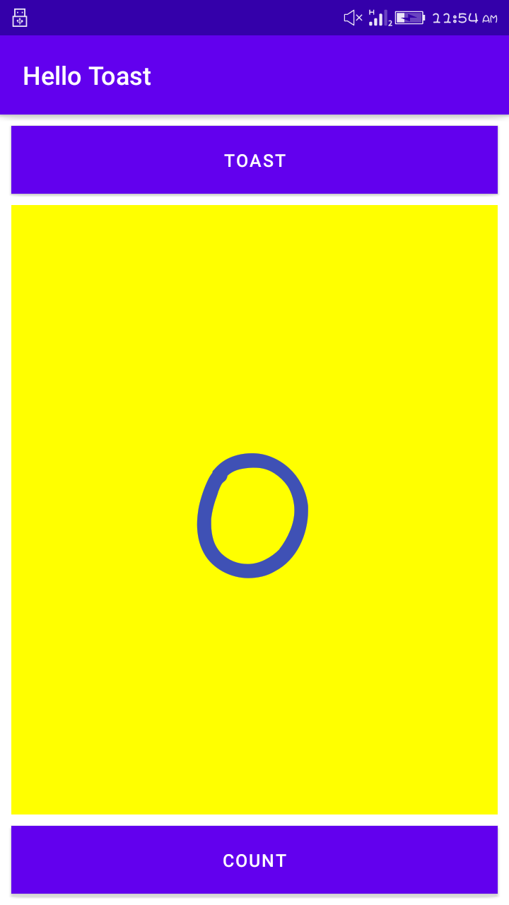
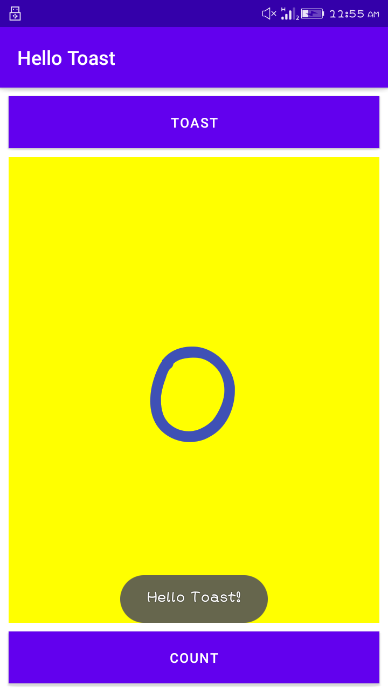
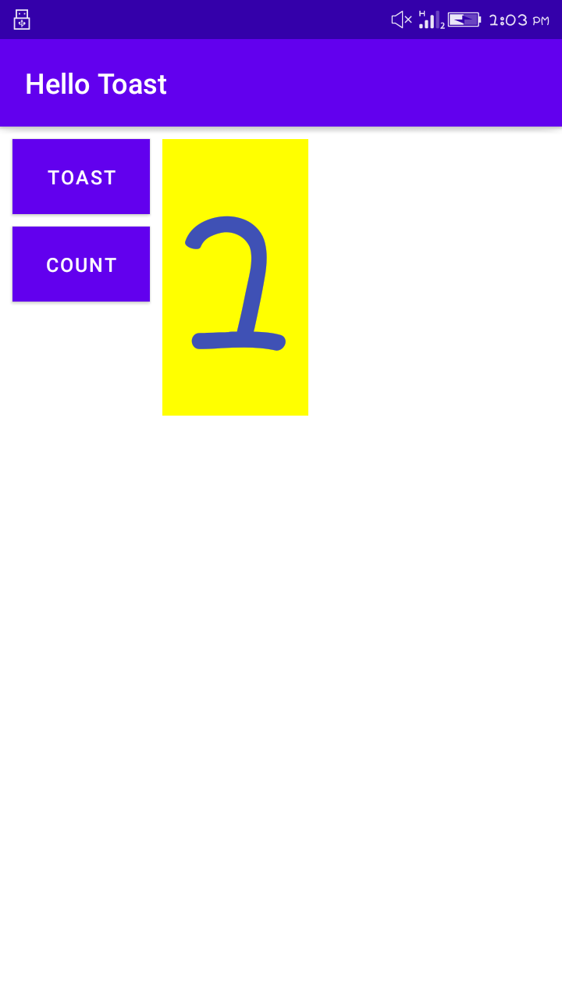
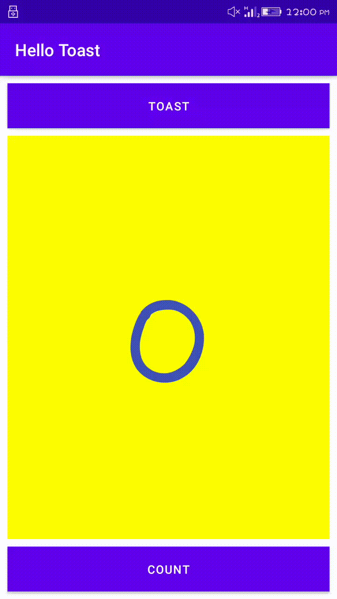

# Lab Work 1
## Hello Toast and Counter

**This is the first lab Exercise "My First Interactive UI" and this readme file consist of the screenshot and 
video i.e. gif file for thr final app created**

### The App UI

**The screenshot above shows the UI of the final app created in this lab exercise first. This app consist of two button and one text view.
when the toast button is pressed , a toast message will display and when we press the count button it will increase the value of the counter.**

### ToastButton is Clicked

**The above screenshot show the toast message when the toast button is clicked.**

### CountButton is Clicked

**The screenshot above shows the increment in the counter value when the count button is pressed.**

### Record Of Application

**The above gif file show the working process of the application**